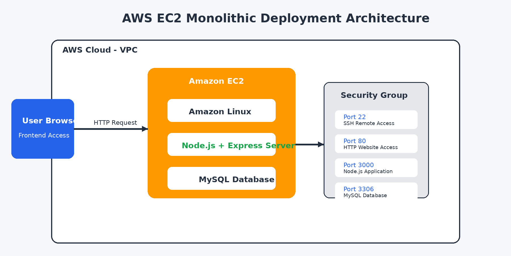

# 📘 Personal Notes Manager Deployment on AWS EC2

## Monolithic Web Application Deployment Project 

## Project Title:

### **Personal Notes Manager – Monolithic Web Application Deployment on AWS EC2**

## Project Objective:

The main objective of this project is to design, develop, and deploy a monolithic full-stack web application on AWS EC2 cloud infrastructure using modern web technologies.

This project demonstrates:
- Full-stack web development
- Monolithic architecture implementation
- AWS EC2 deployment
- Linux server management
- REST API integration
- Database connectivity using MySQL
- Real-time CRUD operations

## Project Overview:

The Personal Notes Manager is a cloud-hosted web application where users can:
- Create notes
- Edit notes
- Delete notes
- Search notes dynamically

The application uses:
- HTML, CSS, JavaScript for frontend
- Node.js + Express.js for backend
- MySQL database for data storage
- AWS EC2 for deployment

The entire application is deployed on a single EC2 instance, making it a monolithic deployment architecture.

## Monolithic Architecture:

In monolithic architecture:
- Frontend
- Backend
- APIs
- Database connectivity

are combined into one deployable application.

## System Architecture Diagram:


<br>

## Step-by-Step Deployment Process:

### Step 1: Launch EC2 Instance

- Login to AWS Console
- Open EC2 Dashboard
- Launch Amazon Linux instance
- Allow ports:
  - 22 (SSH)
  - 80 (HTTP)
  - 3000 (NodeJS)
  - 3306 (MySQL)


<br>
<br>

<br>

### Step 2: Connect to EC2

```bash
ssh -i key.pem ec2-user@your-public-ip
```

### Step 3: Upload Project Files


<br>

### Step 4: Install Node.js, MySQL, Install Dependencies, Create Databse and Run Application


<br>
<br>


<br>


### Step 5: Access Application

Open incognito window in broeser and paste url,
```text
http://your-public-ip
```


<br>
<br>


<br>
<br>


<br>
<br>


<br>

## Features:

- Create Notes
- Edit Notes
- Delete Notes
- Search Notes
- Responsive UI
- Animated Dashboard
- Font Awesome Icons
- AOS Animations

## Limitations:

- Single server architecture
- No authentication
- Limited scalability


## Conclusion:

The Personal Note Manager project successfully demonstrates deployment of a monolithic full-stack web application on AWS EC2 using Node.js, Express.js, and MySQL.

This project provided practical exposure to:
- Cloud computing
- Web development
- Server management
- Database integration
- Real-world deployment process

---
